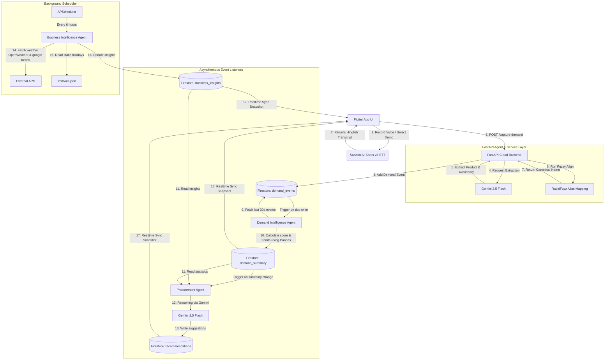

# Saudagar AI - System Architecture

This document details the software architecture, sequence diagrams, and agent roles for Saudagar AI.

---

## Architecture Diagram (Event-Driven Data Flow)

---

## Agent Roles and Specifications

### 1. Demand Capture Agent
- **Trigger**: Receives POST to `/capture-demand` (or audio bytes on `/upload-audio`).
- **Function**: Uses Gemini to extract a structured representation of the customer's request. Uses RapidFuzz to match spelling/variant aliases against the catalog. If unresolved, queries Gemini to match existing categories.
- **Write**: Stores the final aligned request in the `demand_events` collection.

### 2. Demand Intelligence Agent
- **Trigger**: Fires immediately after the Demand Capture Agent writes a new event (simulated via FastAPI BackgroundTasks).
- **Function**: Queries all recent events for the specific shop, parses them into a Pandas DataFrame, and calculates aggregated metrics (unavailable counts, request frequency, demand scores, moving averages).
- **Write**: Overwrites the single document for the shop in `demand_summary`.

### 3. Business Intelligence Agent
- **Trigger**: APScheduler runs it once on startup and then every 6 hours.
- **Function**: Gathers external variables: local weather (OpenWeather API), search interest metrics (Google Trends), and upcoming public holidays (local `festivals.json`).
- **Write**: Overwrites the `latest` document in `business_insights`.

### 4. Procurement Agent
- **Trigger**: Conceptually listens to `demand_summary` changes. Simulated via direct trigger after `demand_summary` updates.
- **Function**: Reads the updated `demand_summary` and `business_insights`. Feeds both JSON bodies into Gemini 2.5 Flash with specific instructions to generate purchasing instructions (increase factor, category alignment, timing) matching the `ProcurementRecommendation` schema.
- **Write**: Updates the shop's document in the `recommendations` collection.

---

## Security Framework
- **Secrets Isolation**: No API keys (Gemini, Sarvam AI, OpenWeather) or Firebase private credentials are ever stored or transmitted to the Flutter client.
- **Direct-to-Client DB Streaming**: The Flutter client establishes read-only listening streams directly to Firestore public client channels (`demand_summary`, `business_insights`, `recommendations`).
- **Restricted Database Writes**: The client is prohibited from writing to Firestore. All state transitions are initiated through FastAPI, which utilizes the Firebase Admin SDK on secure server instances.
