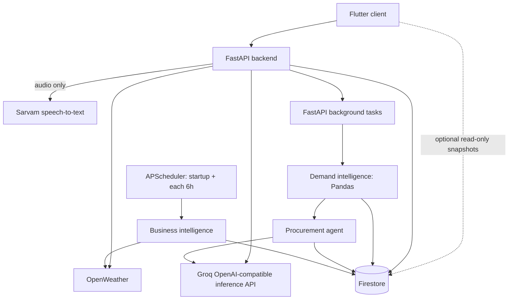

# Saudagar AI - System Architecture

## Data flow

`backend/app/services/gemini_service.py` is a legacy filename. Its active HTTP client calls Groq using `GROQ_API_KEY`; it does not call Gemini at runtime.

## Components

- **Flutter client:** captures audio/text and displays dashboard data. With `useLiveFirestore=false`, it polls FastAPI rather than listening to Firestore.
- **FastAPI:** owns all writes, validates request bodies with Pydantic, runs the capture pipeline, and schedules background processing.
- **Demand capture:** uses two LLM passes for extraction and verification. Only verified events are persisted.
- **Demand intelligence:** aggregates up to 500 events for a shop via Pandas, then triggers procurement recommendation generation.
- **Business intelligence:** obtains Mumbai weather, reads the local festival calendar, and derives simple weather-based trend scores.
- **Firestore:** persists catalogue, events, summaries, insights, recommendations, and feedback when configured.

## Resilience boundary

At startup, an unavailable Firestore configuration selects an in-memory mock database. Weather has a seasonal mock fallback. Missing Sarvam credentials return mock transcription. LLM recommendation generation can return rule-based recommendations; however, failed/ambiguous LLM demand extraction is rejected rather than stored.

The application currently has no provider-specific rate-limit handling, automatic runtime Firestore failover, durable offline queue, dependency-health endpoint, or monitoring/alerting. HTTP polling silently ignores failed polls, so stale dashboard data is possible. These constraints are intentional prototype limitations and must be addressed before a production deployment.

## Security notes

- API/service credentials are backend-only; do not place them in Flutter configuration.
- The client should have read-only Firestore access limited to its intended collections.
- The current CORS wildcard is for prototype development. Configure explicit production origins.
- Treat the mock Firestore database as non-persistent demo data, not as a backup.
